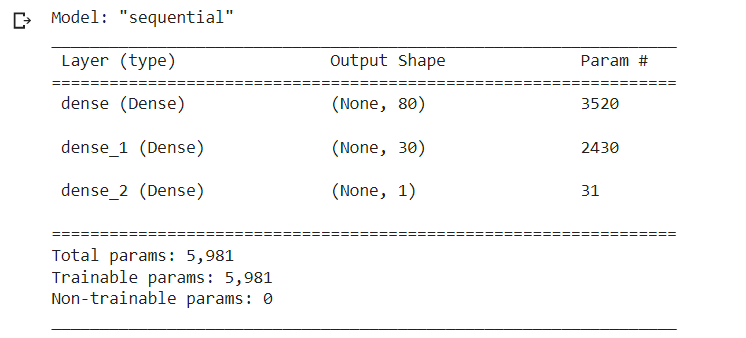

# Neural Network Charity Analysis (Module Challenge 19)

[Link to Deliverable 1 code](Neural_Network_Charity_Analysis.ipynb)

[Link to Deliverable 2 code](Neural_Network_Charity_Analysis_Optimize.ipynb)

## Charity Analysis

### Overview

The purpose of this project is to create a binary classifier that is capable of predicting whether applicants will be successful if funded by charity Alphabet Soup.

Alphabet Soup’s business team provided a CSV containing more than 34,000 organizations that have received funding from Alphabet Soup over the years. 

Within this dataset are a number of columns that capture metadata about each organization.  

Using TensorFlow, this project creates a deep learning binary classification model that can predict if an Alphabet Soup–funded organization will be successful based on the features in the dataset. 

The following deliverables are provided:

* Deliverable 1: Preprocessing Data for a Neural Network Model

* Deliverable 2: Compile, Train, and Evaluate the Model

* Deliverable 3: Optimize the Model

### Results

Data Preprocessing

1. What variable(s) are considered the target(s) for your model?
   IS_SUCCESSFUL—Was the money used effectively

2. What variable(s) are considered to be the features for your model?
   APPLICATION_TYPE—Alphabet Soup application type
   AFFILIATION—Affiliated sector of industry
   CLASSIFICATION—Government organization classification
   USE_CASE—Use case for funding
   ORGANIZATION—Organization type
   STATUS—Active status
   INCOME_AMT—Income classification
   SPECIAL_CONSIDERATIONS—Special consideration for application
   ASK_AMT—Funding amount requested

3. What variable(s) are neither targets nor features, and should be removed from the input data?
   EIN and NAME—Identification columns

Compiling, Training, and Evaluating the Model

1. How many neurons, layers, and activation functions did you select for your neural network model, and why?
   Initial model, based on starter code guidance:

   

2. Were you able to achieve the target model performance?
   No, the initial model resulted in accuracy less than the target of 75%.

   

3. What steps did you take to try and increase model performance?
   * Attempted to reduce noisy variables by revising binning for the APPLICATION_TYPE and CLASSIFICATION variables
   * Added a third hidden layer with 12 neurons
   * Changed the activation function for all hidden layers to Tahn
 
### Summary
The optimized model resulted in slightly increased accuracy, but still below the targeted 75%.

Based on these results, it appears that the deep learning model may have overcomplicated this classification problem.

Using a Random Forest model may be a suitable alternative as its methodology is less complex and it requires less computation power.
